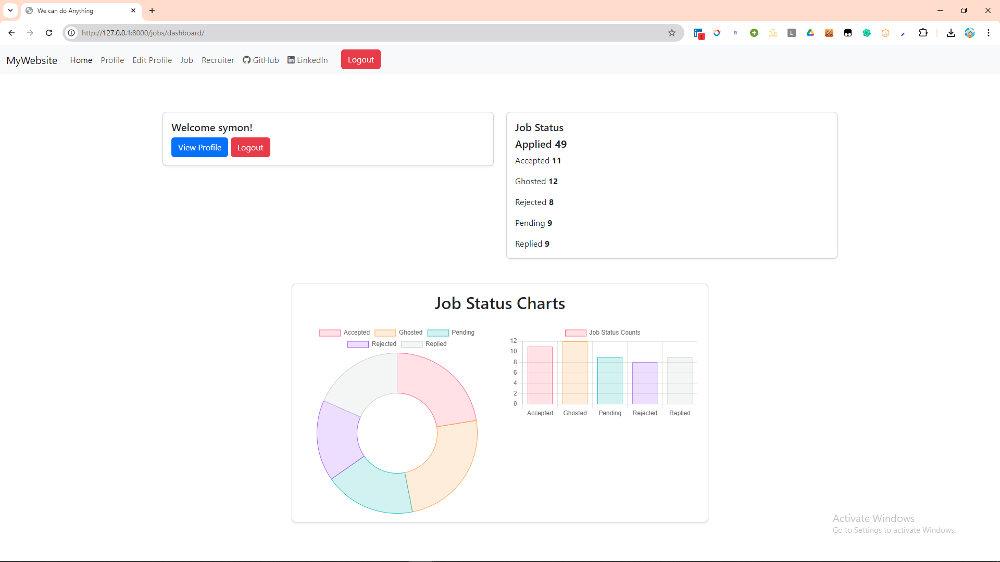
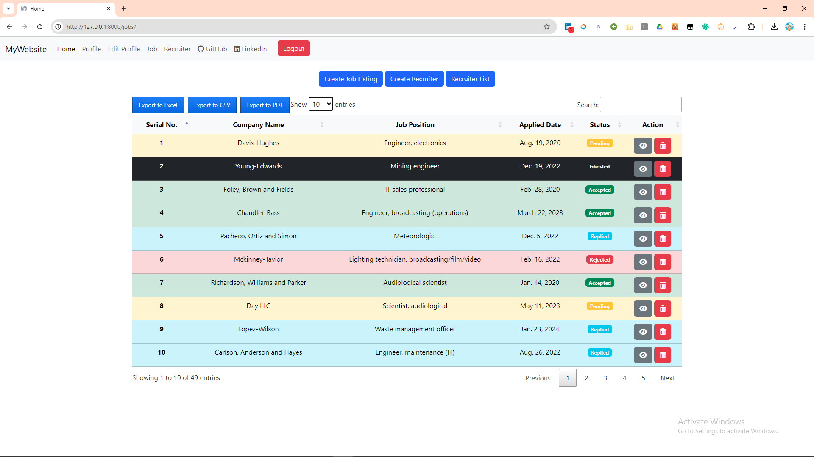
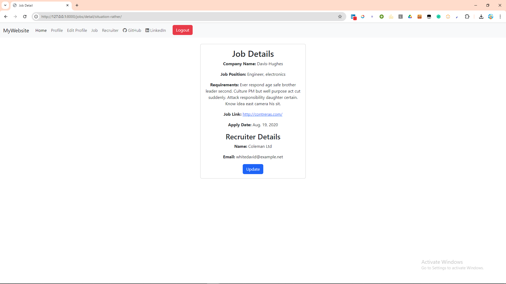
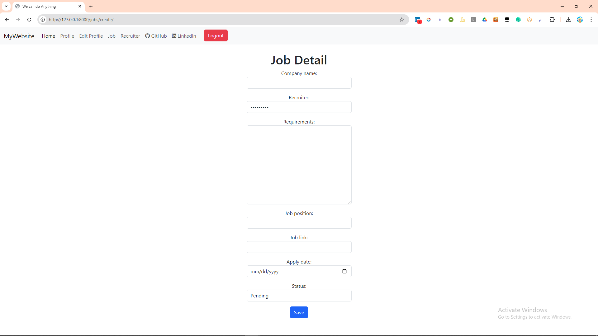
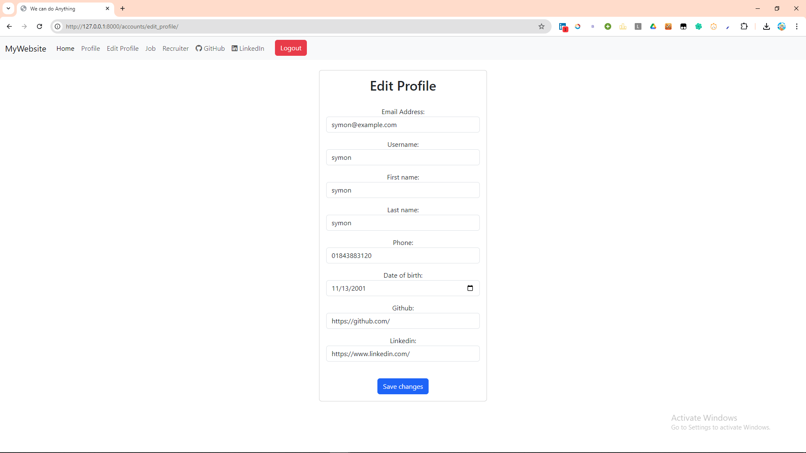
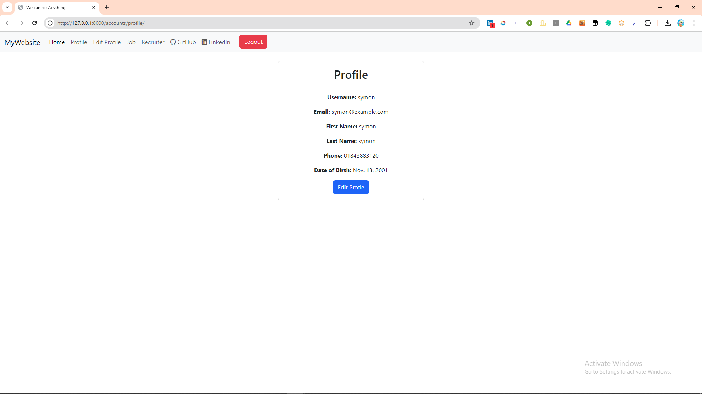
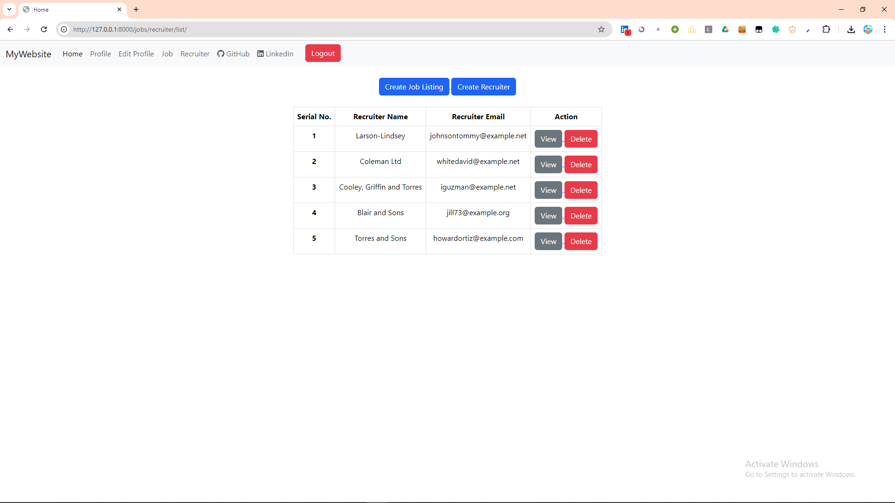
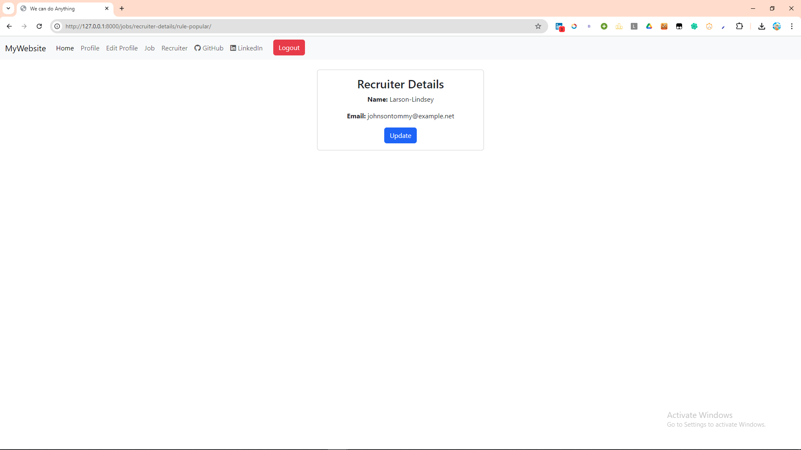
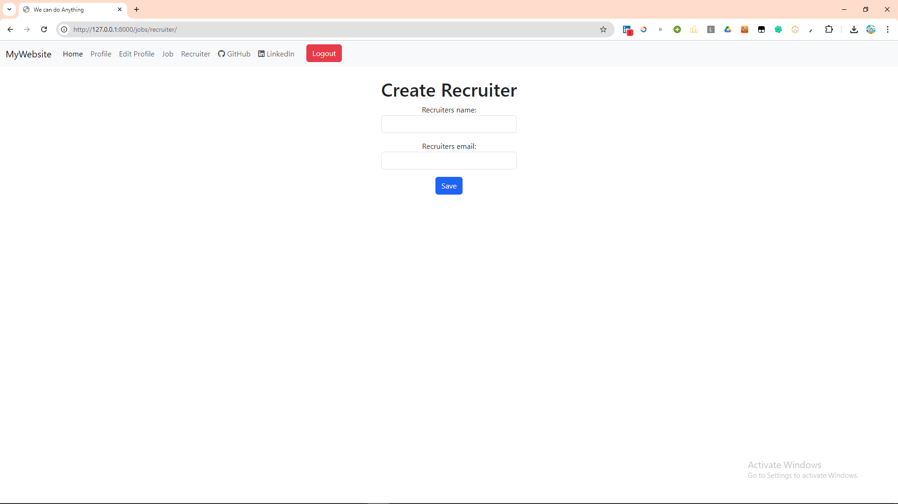

<h1 align="center">Welcome to Job Listing Tracker 👋</h1>

  
  

> Job Tracker is a web application that allows users to manage their job applications and track interactions with recruiters. Designed to help job seekers keep track of their applications.

### 🏠 [Homepage](screenshots/homepage.png)

## Screenshots

### Homepage

### Job List

### Job Details

### Create Job Post

### Edit Profile

### Profile

### Recruiter List

### Recruiter's Detail

### Recruiter's Info

## Author

👤 **Symon**

* Github: [@sin1ter](https://github.com/sin1ter)

## Show your support

Give a ⭐️ if this project helped you!

## License

This project is licensed under the MIT License - see the [LICENSE](LICENSE) file for details.
